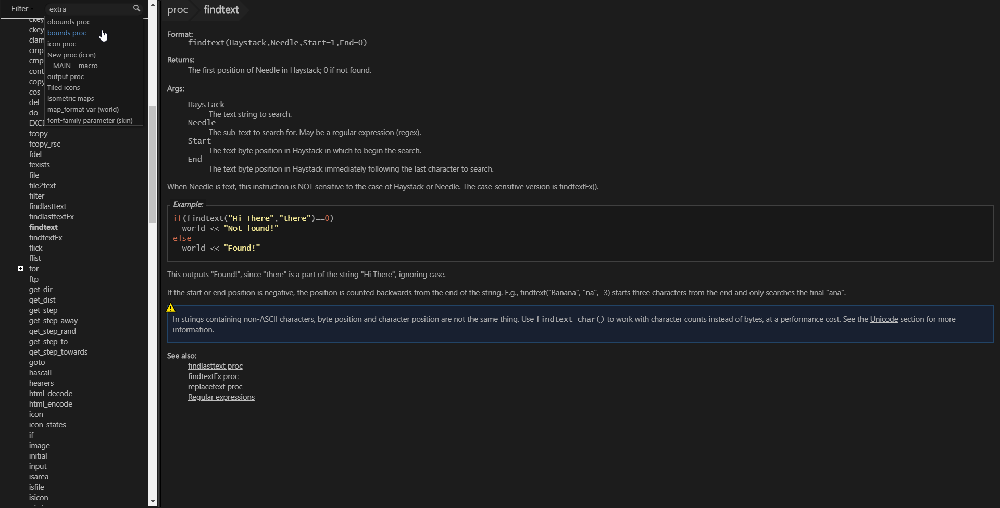

# Byond-Dark, a dark theme for the BYOND docs

Inspired by StylishThemes/GitHub-Dark, I wrote this to make reading the BYOND documentation more immersive.

## Preview

## Installation

Install [Stylus](https://add0n.com/stylus.html) for either [Firefox](https://addons.mozilla.org/en-US/firefox/addon/styl-us/), [Chrome](https://chrome.google.com/webstore/detail/stylus/clngdbkpkpeebahjckkjfobafhncgmne) or [Opera](https://addons.opera.com/en-gb/extensions/details/stylus/) or [Cascadea for Safari](https://cascadea.app/) and then install the theme using this link:

[UserCSS File](https://github.com/bobbahbrown/ByondDark/raw/master/byond-dark.user.css)